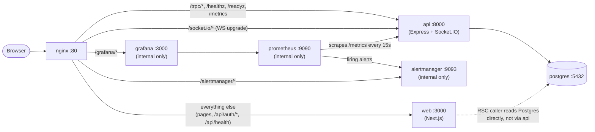

# TaskFlow

> Project management SaaS with real-time collaboration, role-based access control, and Kanban boards.

## Monorepo structure

| Path                | Description                                    |
| ------------------- | ---------------------------------------------- |
| `apps/web`          | Next.js 16 web app                             |
| `apps/api`          | Express 5 + Socket.IO API                      |
| `packages/shared`   | Zod schemas + domain types                     |
| `packages/database` | Prisma 7 schema + migrations                   |
| `packages/ui`       | Design system primitives                       |
| `packages/config`   | Shared ESLint / TS / Tailwind / Vitest configs |

## Getting started

```bash
# 1. Install dependencies
pnpm install

# 2. Copy env file and fill in values
cp .env.example .env

# 3. Generate each package's own .env/.env.local from the root .env
#    (Turborepo runs each package's script with THAT package as its cwd, so
#    apps/api's dotenv.config() and apps/web's own Next.js env loading never
#    see the root .env directly - only `docker compose` does. Re-run this
#    after editing the root .env. See scripts/sync-env.mjs.)
pnpm sync-env

# 4. Start Postgres
docker compose up -d postgres

# 5. Run migrations and seed
pnpm --filter @taskflow/database db:migrate:deploy
pnpm --filter @taskflow/database db:seed

# 6. Start all apps in dev mode
pnpm dev
```

## Docker

`docker compose up` brings the entire stack live behind a single nginx origin - no
separate frontend/backend hosts, no CORS.

```bash
cp .env.example .env      # first run only - fill in real secrets if you have them
docker compose up -d --build
```

This builds four images (`apps/api/Dockerfile`, `apps/web/Dockerfile`, nginx's stock
image with our config mounted in, and Prometheus's stock image with a startup script
that renders its config - see below), runs `prisma migrate deploy` once via a
`migrate` service, then starts `api`, `web`, `nginx`, `prometheus`, `grafana`, and
`alertmanager`. Once `docker compose ps` shows everything `healthy`, the app is at
`http://localhost` (or `http://localhost:$NGINX_PORT` if you changed it), the
metrics dashboard is at `http://localhost/grafana/` (login `admin` /
`$GRAFANA_ADMIN_PASSWORD` - see `.env.example`), and alerts are at
`http://localhost/alertmanager/`.



`apps/api/src/metrics/` emits Prometheus metrics (HTTP, Socket.IO, domain event
counters, and DB-backed "current total" gauges - see that directory's own
docblocks). `infrastructure/prometheus/` scrapes them and evaluates
`alert-rules.yml` (API down, high 5xx rate, high p95 latency, high event-loop lag);
`infrastructure/grafana/provisioning/` auto-provisions the datasource + a pre-built
"TaskFlow" dashboard; `infrastructure/alertmanager/` routes firing alerts, though
with no real notification channel wired up yet (see `alertmanager.yml`'s own
docblock and `BACKLOG.md`) - alerts are visible at `/alertmanager/` but don't
page/message anyone. Grafana and Alertmanager are both routed through nginx
(`/grafana/`, `/alertmanager/`) rather than publishing their own ports, so they get
the same TLS/routing posture as everything else - see `nginx.conf`'s `grafana`/
`alertmanager` locations.

Prometheus's own `command` renders `prometheus.yml.template` into a real config at
container startup (`sed`, substituting `METRICS_TOKEN` in) - the official image has
no built-in env-var templating, and this is what keeps `METRICS_TOKEN` a single
source of truth instead of a literal that had to be hand-copied into a static
config file.

`infrastructure/nginx/nginx.conf`'s route list is checked against apps/api's actual
routes by `apps/api/tests/unit/infra/nginx-route-sync.test.ts` - a new top-level
route in `apps/api/src/app.ts` that isn't added to both places fails that test
instead of silently 404ing in prod. (`/grafana` and `/alertmanager` are explicitly
exempted there, same as `/socket.io` - neither is an apps/api route.)

### Environment variables

See `.env.example` for the full list with defaults. The ones specific to the
Docker/compose setup:

| Variable                                     | Used by                | Notes                                                                                                                                                                                                 |
| -------------------------------------------- | ---------------------- | ----------------------------------------------------------------------------------------------------------------------------------------------------------------------------------------------------- |
| `NEXT_PUBLIC_API_URL`, `NEXT_PUBLIC_WEB_URL` | `web` (build arg)      | Browser-facing origin, inlined at `next build` time - changing these needs `docker compose build web`, not just a restart.                                                                            |
| `INTERNAL_API_URL`                           | `web`                  | Where apps/web's server-to-server calls (login, verify-email) actually connect - apps/api's internal docker address, NOT the browser-facing origin above. See `.env.example`.                         |
| `NGINX_PORT`                                 | `nginx`                | Public port, default `80`.                                                                                                                                                                            |
| `TRUSTED_PROXY_HOPS`                         | `api` and `web`        | Read independently by both - nginx is the one hop in front of each. Default `1`.                                                                                                                      |
| `METRICS_TOKEN`                              | `api` and `prometheus` | Bearer token gating `/metrics` (required - `api` always runs `NODE_ENV=production` here). Single source of truth - `prometheus` renders it into its own config at startup.                            |
| `GRAFANA_ADMIN_PASSWORD`, `GRAFANA_ROOT_URL` | `grafana`              | Admin login (change before any real deployment) and the external URL Grafana generates links against - override `GRAFANA_ROOT_URL` for a real domain.                                                 |
| `GRAFANA_CSRF_TRUSTED_ORIGINS`               | `grafana`              | Host allow-list for Grafana's CSRF check on panel queries/Live websocket (`root_url` alone isn't enough) - override for a real domain, same as `GRAFANA_ROOT_URL`.                                    |
| `ALERTMANAGER_EXTERNAL_URL`                  | `alertmanager`         | Same idea as `GRAFANA_ROOT_URL` - override for a real domain.                                                                                                                                         |
| `ALERTMANAGER_ADMIN_PASSWORD`                | `nginx`                | Alertmanager has no login of its own - `nginx` enforces HTTP Basic auth (username `admin`) in front of `/alertmanager/` instead, regenerating its `.htpasswd` from this var on every container start. |
| `ENABLE_TEST_ROUTES`                         | (never set here)       | Do not set this in `docker-compose.yml` - it exposes `apps/web`'s E2E-only `/api/test/*` routes.                                                                                                      |

### Verifying it worked

```bash
pnpm lint && pnpm typecheck && pnpm test   # all workspaces
pnpm check:env-parity                       # web service covers every required apps/api env var
docker compose ps                           # api/web/nginx/postgres all "healthy"
```

Out of scope for this compose stack: TLS termination. `http://localhost` is meant
for local dev/demo; a real deployment would put a TLS-terminating load balancer in
front of nginx (or terminate TLS in nginx itself) rather than serve plaintext HTTP
publicly. Grafana and Alertmanager inherit whatever TLS posture nginx has - routing
them through nginx removes their own separate exposure surface, but doesn't add TLS
that nginx itself doesn't have. Authentication is separate from TLS and IS handled:
Grafana has its own login, and nginx puts HTTP Basic auth in front of `/alertmanager/`
(which has no login of its own) - see `ALERTMANAGER_ADMIN_PASSWORD` above.

Also out of scope: a real Alertmanager notification channel (Slack/email/PagerDuty)

- see `BACKLOG.md`. Alert rules fire and are visible at `/alertmanager/`, but
  nothing is notified yet.
