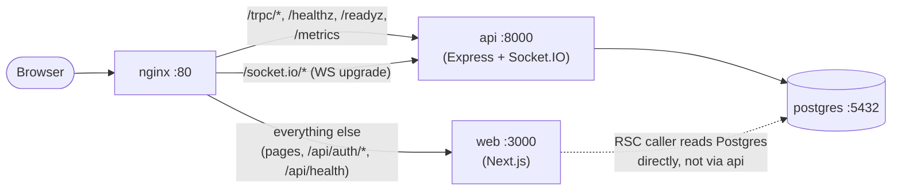

# TaskFlow

> Project management SaaS with real-time collaboration, role-based access control, and Kanban boards.

## Monorepo structure

| Path                | Description                                    |
| ------------------- | ---------------------------------------------- |
| `apps/web`          | Next.js 16 web app                             |
| `apps/api`          | Express 5 + Socket.IO API                      |
| `packages/shared`   | Zod schemas + domain types                     |
| `packages/database` | Prisma 7 schema + migrations                   |
| `packages/ui`       | Design system primitives                       |
| `packages/config`   | Shared ESLint / TS / Tailwind / Vitest configs |

## Getting started

```bash
# 1. Install dependencies
pnpm install

# 2. Copy env file and fill in values
cp .env.example .env

# 3. Generate each package's own .env/.env.local from the root .env
#    (Turborepo runs each package's script with THAT package as its cwd, so
#    apps/api's dotenv.config() and apps/web's own Next.js env loading never
#    see the root .env directly - only `docker compose` does. Re-run this
#    after editing the root .env. See scripts/sync-env.mjs.)
pnpm sync-env

# 4. Start Postgres
docker compose up -d postgres

# 5. Run migrations and seed
pnpm --filter @taskflow/database db:migrate:deploy
pnpm --filter @taskflow/database db:seed

# 6. Start all apps in dev mode
pnpm dev
```

## Docker

`docker compose up` brings the entire stack live behind a single nginx origin - no
separate frontend/backend hosts, no CORS.

```bash
cp .env.example .env      # first run only - fill in real secrets if you have them
docker compose up -d --build
```

This builds three images (`apps/api/Dockerfile`, `apps/web/Dockerfile`, and nginx's
stock image with our config mounted in), runs `prisma migrate deploy` once via a
`migrate` service, then starts `api`, `web`, and `nginx`. Once `docker compose ps`
shows everything `healthy`, the app is at `http://localhost` (or
`http://localhost:$NGINX_PORT` if you changed it).



`infrastructure/nginx/nginx.conf`'s route list is checked against apps/api's actual
routes by `apps/api/tests/unit/infra/nginx-route-sync.test.ts` - a new top-level
route in `apps/api/src/app.ts` that isn't added to both places fails that test
instead of silently 404ing in prod.

### Environment variables

See `.env.example` for the full list with defaults. The ones specific to the
Docker/compose setup:

| Variable                                     | Used by           | Notes                                                                                               |
| -------------------------------------------- | ----------------- | --------------------------------------------------------------------------------------------------- |
| `NEXT_PUBLIC_API_URL`, `NEXT_PUBLIC_WEB_URL` | `web` (build arg) | Inlined at `next build` time - changing these needs `docker compose build web`, not just a restart. |
| `NGINX_PORT`                                 | `nginx`           | Public port, default `80`.                                                                          |
| `TRUSTED_PROXY_HOPS`                         | `api` and `web`   | Read independently by both - nginx is the one hop in front of each. Default `1`.                    |
| `ENABLE_TEST_ROUTES`                         | (never set here)  | Do not set this in `docker-compose.yml` - it exposes `apps/web`'s E2E-only `/api/test/*` routes.    |

### Verifying it worked

```bash
pnpm lint && pnpm typecheck && pnpm test   # all workspaces
pnpm check:env-parity                       # web service covers every required apps/api env var
docker compose ps                           # api/web/nginx/postgres all "healthy"
```

Out of scope for this compose stack: TLS termination. `http://localhost` is meant
for local dev/demo; a real deployment would put a TLS-terminating load balancer in
front of nginx (or terminate TLS in nginx itself) rather than serve plaintext HTTP
publicly.
